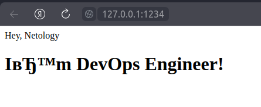

# Домашнее задание к занятию 3.

«Введние. Экосистема. Архитектру. Жизненный цикл Docker-контейнера»

### Задание 1
* Ссылка на образ:

https://hub.docker.com/layers/vladimirkru/4_nginx/fnginx/images/sha256-d34e8a205dc53d1983e9aa870b84ec1bc583b46156dee0ad7eda4dd976005031?context=repo

* Для запуска контейнера

docker run -d -p 1234:80 fnginx

### Задание 2

Посмотрите на сценарий ниже и ответьте на вопрос: «Подходит ли в этом сценарии использование Docker-контейнеров или лучше подойдёт виртуальная машина, физическая машина? Может быть, возможны разные варианты?»

Детально опишите и обоснуйте свой выбор.

Сценарий:

* высоконагруженное монолитное Java веб-приложение;

Могу судить только исходя из изученных статей: для тестирования или разработки использование
docker подходит, но при работе в продакшн есть минусы использования данного решения из-за проблем прожорливости памяти java 

* Nodejs веб-приложение;

В данном случае использование docker подойдет, он без труда позволит создать рабочий контейнер разместить его в хранилище docker и восстановить его для будущего или повторного использования.

* мобильное приложение c версиями для Android и iOS;

Использование docker позволит сократить время сборки окружения и приложений для разработки, а быстрая развертка приложений актуальных версих избавит от головоной боли.

* шина данных на базе Apache Kafka;

Docker позволит создать отказоустойчивую систему + со стабильной системой резервного копирования.

* Elasticsearch-кластер для реализации логирования продуктивного веб-приложения — три ноды elasticsearch, два logstash и две ноды kibana;

Исходя из рассмотренных статей, данный прием будет являться не очень практичным с точки зрения применения в реальных боевых условиях, поскольку есть готовые образы elastic, а логи можно отправлять напрямую, минуя logstash.

* мониторинг-стек на базе Prometheus и Grafana;
 
Можно создать свой образ с настройкой уведомлений на telegram или готовый для быстрой развертки.
 
* MongoDB как основное хранилище данных для Java-приложения;

Подойдет для изоляции и возможности переноса БД. Docker позволит быстро запускать новые экземпляры БД, а связь контейнеров можно будет настроить через общую сеть docker.

* Gitlab-сервер для реализации CI/CD-процессов и приватный (закрытый) Docker Registry.

Использование docker позволит создать изолированную систему и решит вопрос обновления. Но вариант применения ВМ тоже подойдет.

### Задание 3

* запустите первый контейнер из образа centos c любым тегом в фоновом режиме, подключив папку /data из текущей рабочей директории на хостовой машине в /data контейнера.

cio@hp-lx:~$ docker run -v /data:/data --name centos_cont -d -t centos

Unable to find image 'centos:latest' locally

latest: Pulling from library/centos

a1d0c7532777: Pull complete 

Digest: sha256:a27fd8080b517143cbbbab9dfb7c8571c40d67d534bbdee55bd6c473f432b177

Status: Downloaded newer image for centos:latest

a32ef0c986f8c8b82e6353e91e308105fc367fdcf58c3d36f15ee65d4dbcbbd8

* Запустите второй контейнер из образа debian в фоновом режиме, подключив папку /data из текущей рабочей директории на хостовой машине в /data контейнера.

cio@hp-lx:~$ docker run -v /data:/data --name debian_cont -d -t debian

Unable to find image 'debian:latest' locally

latest: Pulling from library/debian

918547b94326: Pull complete 

Digest: sha256:63d62ae233b588d6b426b7b072d79d1306bfd02a72bff1fc045b8511cc89ee09

Status: Downloaded newer image for debian:latest

1182e7afeedda71e57b4b613b8149c42105030bf86ec106488b606a52b7bbe0d

* Подключитесь к первому контейнеру с помощью docker exec и создайте текстовый файл любого содержания в /data.

cio@hp-lx:~$ docker exec centos_cont /bin/bash -c "echo first_line>/data/test.md"

* Добавьте ещё один файл в папку /data на хостовой машине.

cio@hp-lx:~$ sudo touch /data/test_host.md

[sudo] пароль для cio: 

cio@hp-lx:~$ sudo vi /data/test_host.md 

* Подключитесь во второй контейнер и отобразите листинг и содержание файлов в /data контейнера.

cio@hp-lx:~$ docker exec -it debian_cont /bin/bash

root@1182e7afeedd:/# cd /data/

root@1182e7afeedd:/data# ls -l
total 8

-rw-r--r-- 1 root root 11 May  9 11:51 test.md

-rw-r--r-- 1 root root 11 May  9 11:53 test_host.md

### Задание 4

* Ссылка на образ:

https://hub.docker.com/layers/vladimirkru/virt-repo/latest/images/sha256-b0d5a93877c45bca80e658acd51e1a2758be710c19b66d50f2685688b4c6381f?tab=layers

