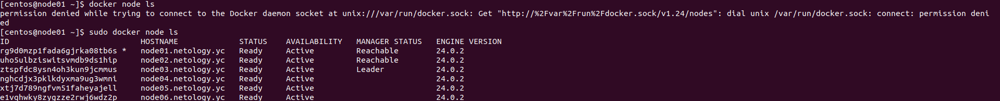
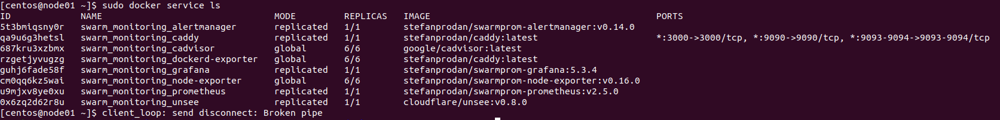
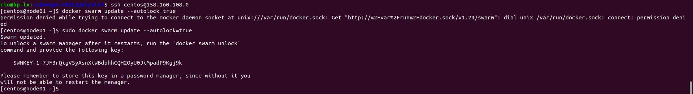
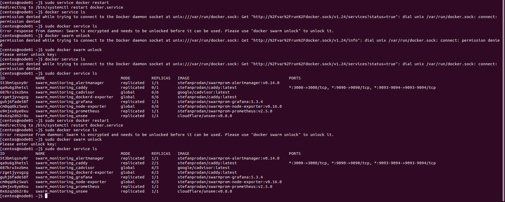

### Задание 1

Дайте письменые ответы на вопросы:

* В чём отличие режимов работы сервисов в Docker Swarm-кластере: replication и global?
    - Для реплицированного сервиса указывается, сколько идентичных задач необходимо запустить. Например, развернуть сервис HTTP с тремя репликами.
    - Глобальный сервис — запускает одну задачу на каждой ноде. Предварительно заданного количества задач нет. Например, на роль глобальных сервисов являются агенты мониторинга, антивирусные сканеры или другие типы.

* Какой алгоритм выбора лидера используется в Docker Swarm-кластере?

    - Это достигается за счет того, что в кластере могут одновременно работать несколько управляющих нод, которые могут в любой момент заменить вышедшего из строя лидера. Если говорить более подробно, то используется так называемый алгоритм поддержания распределенного консенсуса — Raft.
* Что такое Overlay Network?

    - Overlay-сеть создает подсеть, которую могут использовать контейнеры в разных хостах swarm-кластера. Контейнеры на разных физических хостах могут обмениваться данными по overlay-сети (если все они прикреплены к одной сети).

### Задание 2

Создайте ваш первый Docker Swarm-кластер в Яндекс Облаке.

Чтобы получить зачёт, предоставьте скриншот из терминала (консоли) с выводом команды:

### Задание 3

Создайте ваш первый, готовый к боевой эксплуатации кластер мониторинга, состоящий из стека микросервисов.

Чтобы получить зачёт, предоставьте скриншот из терминала (консоли), с выводом команды:

### Задание 4

Выполните на лидере Docker Swarm-кластера команду, указанную ниже, и дайте письменное описание её функционала — что она делает и зачем нужна:

Данная команда активирует режим и создает ключ, который служит для разблокировки логов raft (зашифрованные данные).
Ключ необходимо вводить после каждого перезапуска ноды, для последующего присоединения к кластеру и разблокировки журналов.
